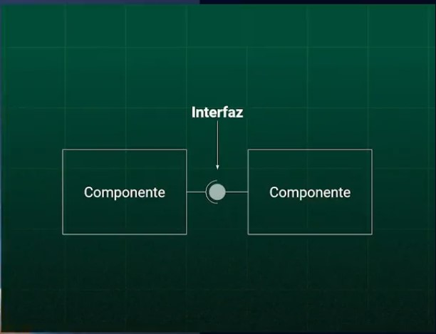
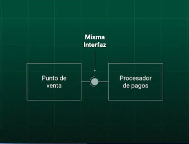
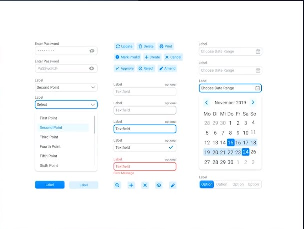
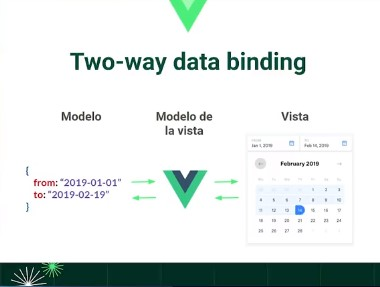
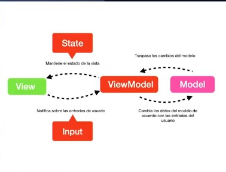

# platzi-vuejs-fundamentals
Curso de introducción  a Vue.js Platzi

## Desarrollo basado en componentes

No esta solo relacionado a web es un concepto de arquitectura de software, que nos permite dividir una aplicación en piezas pequeñas y reutilizables. Abstraer todas las partes del software e interacturan entre sí a través de una interfaz.




## Componentes UI

Cada vez que vemos una página web vemos algo como esto, una interfaz de usuario, que esta compuesta por componentes, que a su vez son piezas de software que se pueden reutilizar.




## Two way data binding

Es la forma en la que los componentes se comunican entre sí, es decir, cuando un componente cambia de estado, los demás componentes se enteran y se actualizan.

Two Way Data Binding es un patrón MVVM (model - view - view - model) donde se enlazan dos elementos en dos direcciones (cuando cambia uno cambia el otro). Sirve para tener los datos sincronizados con el DOM sin hacer esfuerzos adicionales.



### Vista

Aquí tenemos el HTML. La vista se encarga de decirle al estado que hay cambios, a lo cual el estado va a reaccionar y mandar una nueva vista. Todo lo que el usuario puede interacturar

### Estado

Aquí tenemos el estado de la aplicación. El estado es un objeto que contiene la información de la aplicación. El estado se encarga de decirle a la vista que hay cambios, a lo cual la vista va a reaccionar y mandar un nuevo estado. Un botón puede tener un estado de activo o inactivo, un input puede tener un estado de texto escrito o no escrito.

### Usuario

El usuario es el que interactúa con la aplicación. El usuario va a interactuar con la vista, a lo cual la vista va a reaccionar y mandar un nuevo estado.



## Configuración de Vue.js

Antes de empezar necesitamos el cdn de Vue.js

```html
    <script src="https://cdn.jsdelivr.net/npm/vue/dist/vue.js"></script>
```

Con el cdn podemos empezar a trabajar con Vue.js agregando nuestro código debajo del cdn

```html
    <script>
        new Vue({
            el: '#app',
            data: {
                message: 'Hello Vue.js'
            }
        })
    </script>
```

Al final nos quedaria algo como esto

```html
<!DOCTYPE html>
<html lang="en">
<head>
    <meta charset="UTF-8">
    <meta name="viewport" content="width=device-width, initial-scale=1.0">
    <meta http-equiv="X-UA-Compatible" content="ie=edge">
    <title>Vue.js</title>
</head>
<body>
    <div id="app">
        <h1>{{ message }}</h1>
    </div>
    <script src="https://cdn.jsdelivr.net/npm/vue/dist/vue.js"></script>
    <script>
        const app = Vue.createApp({
            data: {
                message: 'Hello Vue.js'
            }
        }).mount('#app')
    </script>
</body>
</html>
```

